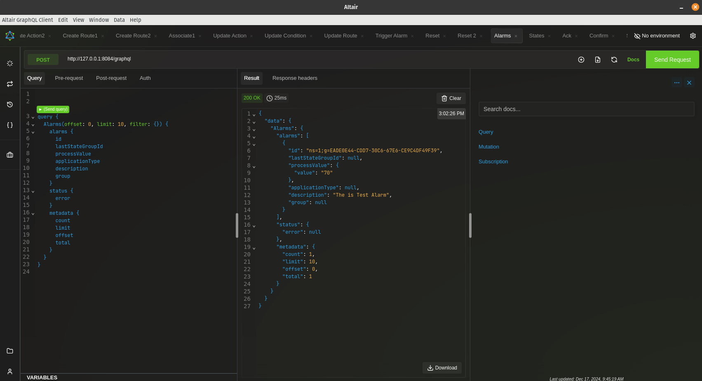
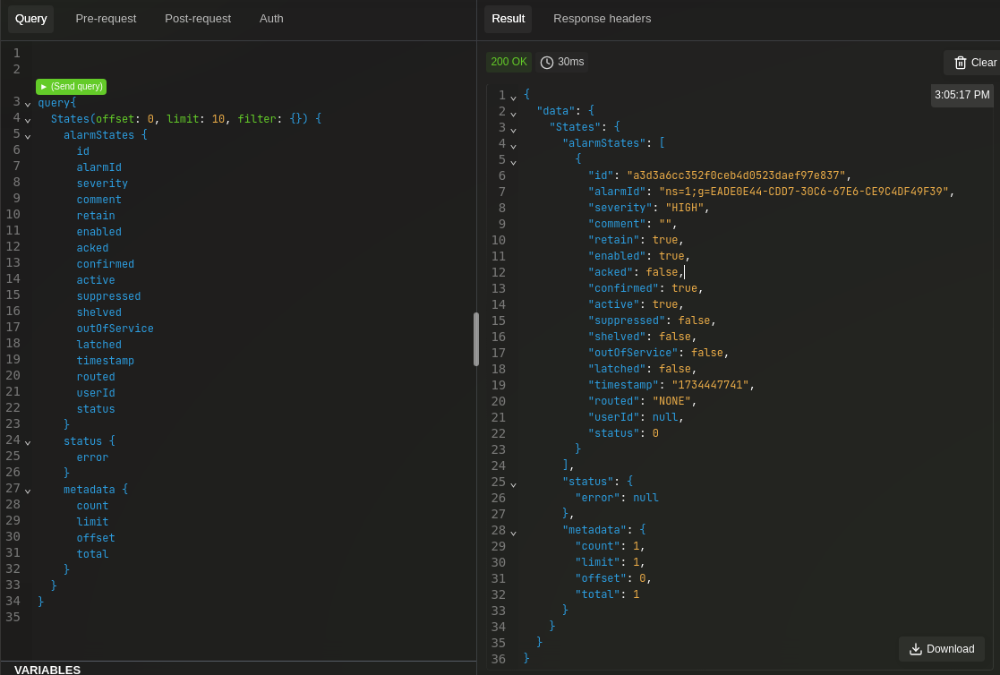
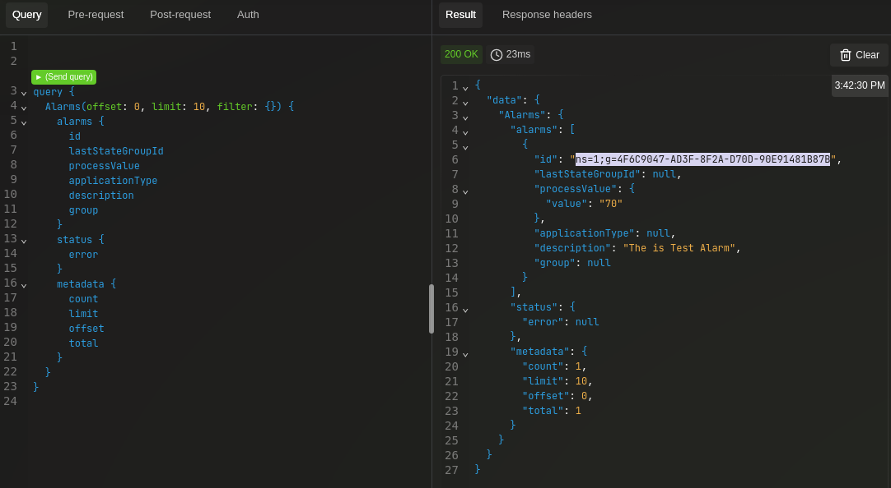
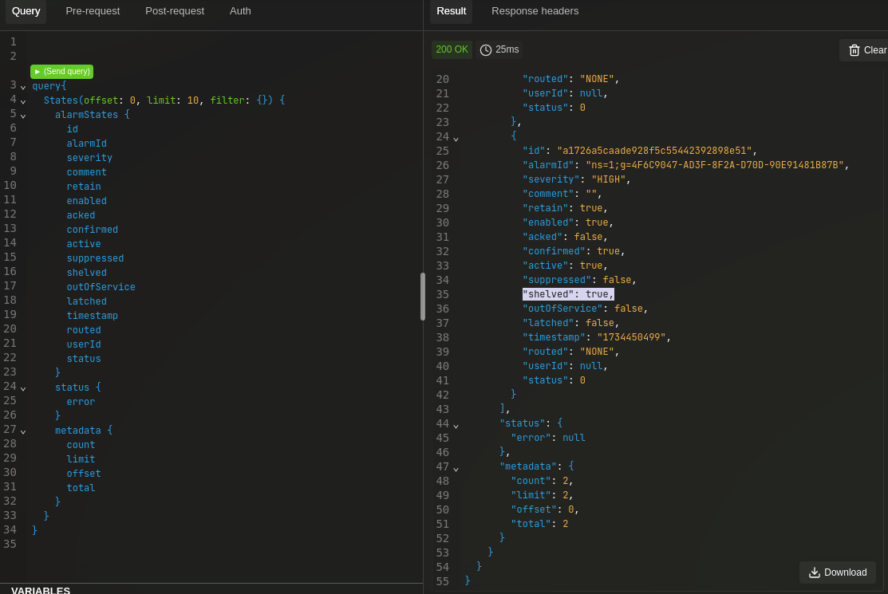

# Walkthrough of Alarms and States management API

In the following tutorial, we demonstrate the steps to manage Alarms and Alarm States in the Alarm Service using [Altair](https://altairgraphql.dev/) GraphQL client.

The Alarm Service is built on top of the OPC UA standard. In OPC UA, alarms (also called conditions) are objects that monitor a particular situation and can become active when specific criteria are met. They are used to alert operators about important system conditions that may require attention.

Alarms have multiple attributes that track their status:

- Active: Whether the underlying condition is currently evaluating to true
- Enabled: Whether the alarm is allowed to evaluate its condition
- Acknowledged: Whether an operator has seen the alarm
- Confirmed: Whether corrective action has been taken
- Shelved: Temporarily hidden from operators
- Suppressed: Prevented from activating due to system conditions
- OutOfService: Under maintenance

States represent point-in-time snapshots of an alarm's condition. Each time an alarm's attributes change (like becoming active or being acknowledged), a new state is created. This creates an audit trail of how the alarm evolved over time which can be accessed through this API.

The API shown implements this through:
```
type AlarmState {
    id: ID!
    alarmId: ID! 
    severity: SeverityType!
    active: Boolean!
    acked: Boolean!
    confirmed: Boolean
    # ... other attributes
    timestamp: String!
}
```

For example, when an alarm becomes active:

1) A new state is created with active: True
2) When an operator acknowledges it, another state is created with acked: True
3) When the condition clears, another state is created with active: False

This creates a complete history of the alarm's lifecycle that can be queried and analyzed later.

This lifecycle from active to inactive is represented by state groups which we will cover in the next tutorial.

The API provides mutations for all common alarm operations like AcknowledgeState, ConfirmState, ShelveAlarm, etc. and queries to retrieve both current alarms and historical states. In this tutorial we will go over how to query Alarm and Alarm States then how to use method calls to change the state of the alarms.

**Table of Contents**
- [Altair](#Altair)
- [Querying alarms and states](#querying-alarms-and-states)
- [Acknowledge and Confirm](#acknowledge-and-confirm)
- [Shelve and Unshelve](#shelve-and-unshelve)
- [Suppress and Unsuppress](#suppress-and-unsuppress)
- [Disable and Enable](#disable-and-enable)

### Altair
- Download and install the tool from https://altairgraphql.dev/#download

- Open the tool, ensuring you set the correct url for the router service, for example: http://127.0.0.1:59893/graphql

### Querying alarms and states

First we will trigger a alarm to ensure there is a alarm with a state within the system. This can be done either by setting a specific value on one of the earlier provisioned Modbus devices or by triggering a test alarm via a direct GraphQL mutation.

- Trigger a device-based alarm by setting the temperature value on one of the Modbus devices to 90 as follows:

```bash
curl -X PUT http://localhost:59882/api/v3/device/name/Controller-0/Temperature -d '{"Temperature":"90"}'
```

Note that in secure mode, a JWT will need to be passed into the request as described [here](https://docs.edgexfoundry.org/4.0/security/Ch-Authenticating/#authentication-for-non-service-clients)

- Or trigger a test alarm by using the following GraphQL mutation:

```GraphQL
mutation {
  TriggerTestAlarm(severity: HIGH) {
    error
  }
}
```

You can then view the alarm you just triggered using the following GraphQL query:
```GraphQL
query {
    Alarms(offset: 0, limit: 10, filter: {}) {
        alarms {
            id
            lastStateGroupId
            processValue
            applicationType
            description
            group
        }
        status {
            error
        }
        metadata {
            count
            limit
            offset
            total
        }
    }
}
```
  

Although a alarm may exist in the underlying system it is only shown in this API when it has been in a active state.

You can also query states as shown below:
```GraphQL
query{
    States(offset: 0, limit: 10, filter: {}) {
        alarmStates {
            id
            alarmId
            severity
            comment
            retain
            enabled
            acked
            confirmed
            active
            suppressed
            shelved
            outOfService
            latched
            timestamp
            routed
            userId
            status
        }
        status {
            error
        }
        metadata {
            count
            limit
            offset
            total
        }
    }
}
```
  

### Acknowledge and Confirm

  Acknowledging an alarm indicates that an operator has seen and is aware of the condition, but doesn't mean they've fixed the underlying issue yet. Confirming an alarm means that appropriate corrective action has been taken to address the condition that triggered it, and is often required in addition to acknowledgment for critical alarms where explicit verification of the fix is needed. This behavior can be configured in the alarm configuration which is out of scope for this tutorial.

  So following on from the last tutorial you can see in the output of the state the fields `"active": true` and `"acked": false`.

- Copy the `id` field of the output window, this is the current state ID.
- This is used when acknowledging, confirming or adding a comment to the state.
- Acknowledge the state using the **copied state id** from the previous step and send the request:
```GraphQL
mutation {
    AcknowledgeState(stateId: "a3d3a6cc352f0ceb4d0523daef97e837") {
        error
    }
}
```

  You can view the new alarm states once again using the following GraphQL query:
```GraphQL
query{
    States(offset: 0, limit: 10, filter: {}) {
        alarmStates {
            id
            alarmId
            severity
            comment
            retain
            enabled
            acked
            confirmed
            active
            suppressed
            shelved
            outOfService
            latched
            timestamp
            routed
            userId
            status
        }
        status {
            error
        }
        metadata {
            count
            limit
            offset
            total
        }
    }
}
```
  A **new state** has been created with the field `"acked": true` in the output window.

  Now lets confirm this alarm:
- Copy the `id` field of the **latest** state from the output window.
- Confirm the **latest** state using the **copied state id** :
```GraphQL
mutation {
    ConfirmState(stateId: "bd3c8d4f72f6824f5cb9ef1e458f8a98") {
        error
    }
}
```

View the alarm states again, you should see a new state with `"confirmed": true` in the output window.
  
Now that the alarm has been acknowledge and confirmed by the operator, let's simulate the condition evaluating false and the alarm going inactive.

- Reset the device-based alarm by setting the temperature value on one of the Modbus devices to 80 as follows:

```bash
curl -X PUT http://localhost:59882/api/v3/device/name/Controller-0/Temperature -d '{"Temperature":"80"}'
```

Note that in secure mode, a JWT will need to be passed in the request as described [here](https://docs.edgexfoundry.org/4.0/security/Ch-Authenticating/#authentication-for-non-service-clients)

- Or reset the test alarm raised via the GraphQL mutation as follows:

```GraphQL
mutation {
  ResetTestAlarm {
    error
  }
}
```

View the alarm states again, you should see a new state with `"active": false` in the output window.

### Shelve and Unshelve
Shelving an alarm temporarily prevents it from being displayed to operators, typically used to hide known nuisance alarms that can't be addressed immediately but will need attention later. Unshelving makes the alarm visible again in operational views, which is done when operators are ready to address the previously shelved alarm condition.

Shelving is managed through straightforward mutations ShelveAlarm and UnshelveAlarm which operate on individual alarms identified by their alarmId. When an alarm is shelved, its state object will have shelved: true, and the API creates a new state to track this change. The ShelveAlarm mutation is one-shot shelving, where the alarm remains shelved until explicitly unshelved by an operator or the alarm goes inactive again.  You can use TimedShelveAlarm mutation that would allow automatic unshelving after a specified duration even if it goes inactive, this feature is marked as unimplemented. Shelved alarms condition are still evaluated and can change states but you can use the filtering to hide all shelved alarm through the api.

Trigger a test alarm using the following GraphQL mutation (or raise the device-based alarm as described above):
```GraphQL
mutation {
  TriggerTestAlarm(severity: HIGH) {
    error
  }
}
```

View the alarm states, you should see a new state with `"shelved": false` in the output window.

View the alarms and copy the `id` field from the output window. This is the **alarm ID** needed for next steps.


Shelve the alarm using the copied alarm ID from the previous step:
```GraphQL
mutation {
  ShelveAlarm(alarmId: "ns=1;g=4F6C9047-AD3F-8F2A-D70D-90E91481B87B") {
    error
  }
}
```
  

View the alarm states again, you should see a new state with `"shelved": true` in the output window.

Unshelve the alarm using the copied alarm ID from the previous step:
```GraphQL
mutation {
  UnshelveAlarm(alarmId: "ns=1;g=4F6C9047-AD3F-8F2A-D70D-90E91481B87B") {
    error
  }
}
```

View the alarm states again, you should see a new state with `"shelved": false` in the output window.

If you shelved the alarm again and then Reset the test alarm using the following GraphQL mutation (or reset the device-based alarm as described above):

```GraphQL
mutation {
    ResetTestAlarm {
        error
    }
}
```

This will also show `"shelved": false` in the latest state because the one shot shelve goes away after the alarm condition evaluated to false making the alarm inactive


### Suppress and Unsuppress
Suppression allows for filtering out of alarms even when its condition becomes true, typically used when there are known operational conditions (like system startup or maintenance) where alarms should be temporarily ignored by the system rather than by operators. Unlike shelving which is operator-initiated, suppression is typically system-initiated and is used when logical criteria determine that an alarm should not occur even though its base condition is present.

Trigger a test alarm using the following GraphQL mutation (or raise the device-based alarm as described above):
```GraphQL
mutation {
  TriggerTestAlarm(severity: HIGH) {
    error
  }
}
```
View the alarm states, you should see a new state with `"suppressed": false` in the output window.

View the alarm and copy the `id` field from the output window. This is the **alarm ID** needed for next steps.

Suppress the alarm using the copied alarm ID from the previous step:
```GraphQL
mutation {
  SuppressAlarm(alarmId: "ns=1;g=5DBCCEE8-3419-9FDF-7277-37336F06C08C") {
    error
  }
}
```

View the alarm states again, you should see a new state with `"suppressed": true` in the output window.

Unsuppress the alarm using the copied alarm ID from the previous step:
```GraphQL
mutation {
  UnsuppressAlarm(alarmId: "ns=1;g=5DBCCEE8-3419-9FDF-7277-37336F06C08C") {
    error
  }
}
```

View the alarm states again, you should see a new state with `"suppressed": false` in the output window.

Reset the test alarm using the following GraphQL mutation (or reset the device-based alarm as described above):
```GraphQL
mutation {
    ResetTestAlarm {
        error
    }
}
```

### OutOfService and InService
Taking alarms out of service indicates they are undergoing maintenance and allowing for these alarms to be filtered out, which is more formal and longer-term than suppression or shelving. Placing equipment back in service returns it to normal operation where it can evaluate conditions and generate alarms again, typically done after maintenance work is complete and the system is ready to resume normal monitoring.

Trigger a test alarm using the following GraphQL mutation (or raise the device-based alarm as described above):
```GraphQL
mutation {
  TriggerTestAlarm(severity: HIGH) {
    error
  }
}
```
View the alarm states, you should see a new state with `"outOfService": false` in the output window.

View the alarm and copy the `id` field from the output window. This is the **alarm ID** needed for next steps.

Place the alarm out-of-service using the copied alarm ID from the previous step:
```GraphQL
mutation {
  RemoveFromServiceAlarm(alarmId: "ns=1;g=E2658F62-3544-3CCD-AB8A-E81E90F9EF6E") {
    error
  }
}
```

View the alarm states again, you should see a new state with `"outOfService": true` in the output window.

Place the alarm in-service using the copied alarm ID from the previous step:
```GraphQL
mutation {
  PlaceInServiceAlarm(alarmId: "ns=1;g=2CE7249E-74CF-A692-0CD0-6DC635734764") {
    error
  }
}
```

View the alarm states again, you should see a new state with `"outOfService": false` in the output window.

Reset the test alarm using the following GraphQL mutation (or reset the device-based alarm as described above):
```GraphQL
mutation {
    ResetTestAlarm {
        error
    }
}
```

### Disable and Enable
Disabling an alarm prevents it from evaluating its underlying condition and generating any new states, effectively turning off the alarm entirely until it is explicitly enabled again. Enabling returns the alarm to normal operation where it can evaluate conditions and create new states, with the alarm immediately evaluating its condition upon being enabled to determine if it should transition to an active state.

Trigger a test alarm using the following GraphQL mutation (or raise the device-based alarm as described above):
```GraphQL
mutation {
  TriggerTestAlarm(severity: HIGH) {
    error
  }
}
```
View the alarm states, you should see a new state with `"enabled": true` in the output window.

View the alarm and copy the `id` field from the output window. This is the **alarm ID** needed for next steps.

Disable the alarm using the copied alarm ID from the previous step:
```GraphQL
mutation {
  DisableAlarm(alarmId: "ns=1;g=1D13DFF3-5EFE-9B92-1F51-9599EBAEEA0E") {
    error
  }
}
```

View the alarm states again, you should see **NO new state** created in the output window as the alarm is disabled.

Enable the alarm using the copied alarm ID from the previous step:
```GraphQL
mutation {
  EnableAlarm(alarmId: "ns=1;g=1D13DFF3-5EFE-9B92-1F51-9599EBAEEA0E") {
    error
  }
}
```

View the alarm states again, you should see a new state with `"enabled": true` in the output window.

Reset the test alarm using the following GraphQL mutation (or reset the device-based alarm as described above):
```GraphQL
mutation {
    ResetTestAlarm {
        error
    }
}
```
