# Walkthrough of Creating Alarm Conditions, Routes and Actions

In the following tutorial, we demonstrate the steps to configure the Alarm Service and specifically how it can be instructed to create a severity-based condition and a route that is associated with an Email action.

We use [Altair](https://altairgraphql.dev/) which is a GraphQL client tool for executing against a GraphQL Server. Altair has a number of interesting features including creating environment variables, schema doc views and searching, and importing/exporting of collections.

The following instructions demonstrate how to use Altair to execute several different GraphQL query and mutate  APIs of the Alarm Service.

<details>
  <summary><strong>Table of Contents</strong></summary>

* [Altair](#Altair)
* [Create a Condition ](#Create-a-Condition)
* [Create a Route ](#Create-a-Route)
* [Create an Action ](#Create-an-Action)
* [Associate the Route and Action ](#Associate-the-Route-and-Action)
* [Trigger a Test Alarm ](#Trigger-a-Test-Alarm)
* [View Alarm and Alarm States ](#View-Alarm-and-Alarm-States)
* [Reset the Test Alarm ](#Reset-the-Test-Alarm)
</details>

### Altair
- Download and install the tool from https://altairgraphql.dev/#download

- Open the tool, ensuring you set the correct url for the router service, for example: http://127.0.0.1:8084/graphql

### Create a Condition

- Create a Condition configured to accept High, Medium, and Low severity levels using the following GraphQL mutation.

Note that all of these snippet can be pasted into the Query window on the left hand pane of Altair, and then excecuted by clicking "Send mutation" or "Send Request". The Result is shown in the middle pane.

```GraphQL
mutation {
  ConditionCreate(input: { name: "Condition1", 
                          severities: [HIGH, MEDIUM, LOW] }) {
    condition {
      id
      name
      deviceNames
      deviceGroups
      severities
      tsCreated
      tsModified
    }
    status {
      error
    }
  }
}
```
  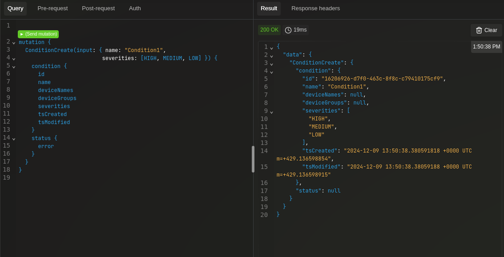

- To ensure the successful creation of the Condition use the following GraphQL query:

** Note to copy the condition ID for the next command**
```GraphQL
query{
  Condition(
    limit: 10,
    offset: 0
  ) {
    conditions {
      id
      name
      severities
      tsCreated
      tsModified
    }
    status {
      error
    }
    metadata {
      count
      limit
      offset
      total
    }
  }
}
```
  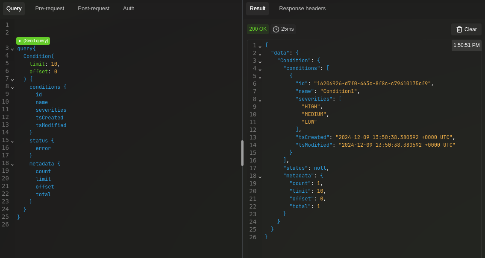

### Create a Route

- Create a Route using the **previously copied condition ID** (compulsory field) using following GraphQL mutation:
```GraphQL
mutation {
  RouteCreate(input: { name: "Route1",
    schedule: "BEGIN:VCALENDAR\r\nVERSION:2.0\r\nCALSCALE:GREGORIAN\r\nBEGIN:VEVENT\r\nDTSTART:20240101T000000Z\r\nDTEND:20240101T235959Z\r\nRRULE:FREQ=DAILY;INTERVAL=1\r\nEND:VEVENT\r\nEND:VCALENDAR",
    conditionId: "8b52d842-70c0-44b6-89bf-3c07574e1645",
    enableStatus: true}) {
    route {
      id
      name
      description
      delay
      retries
      schedule
      tsCreated
      tsModified
    }
    status {
      error
    }
  }
}
```
  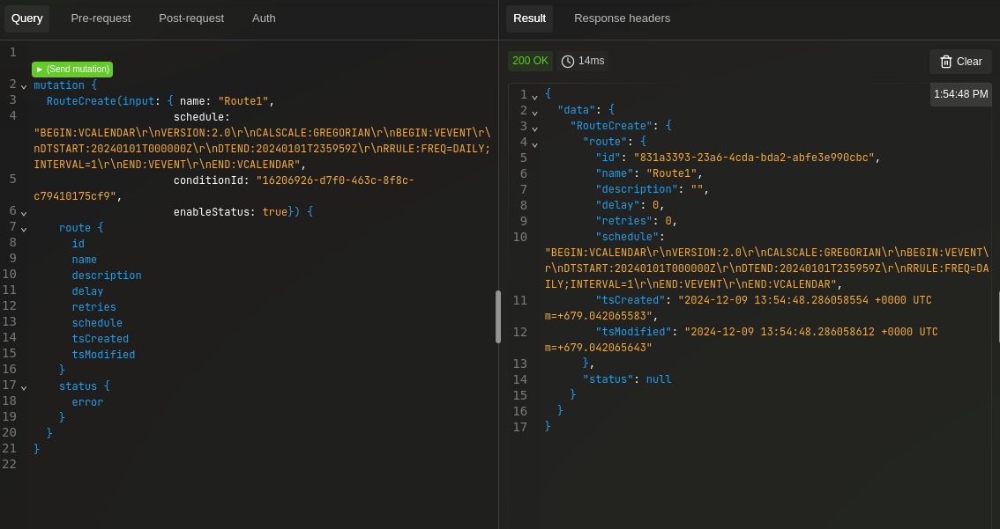
  
  Please notice, we use the iCalendar (RFC 5545) standard format to specify the route's schedule.
  In this example, we allow the route to occur at any time and the string contents have been escaped (using an online free tool such as [link](https://www.freeformatter.com/json-escape.html)) to remove Newline and Carriage return characters in the API call.
  For more iCalendar strings examples, please see this [link](./iCalendar-examples.md).

- To ensure the successful creation of the Route use the following GraphQL query:
```GraphQL
query {
  Route(
    limit: 10
    offset: 0
  ) {
    routes {
      id
      name
      condition {
        id
        name
        severities
      }
      actions{
        id
        name
        type
      }
      delay
      schedule
      enableStatus
      tsCreated
      tsModified
    }
    status {
      error
    }
    metadata {
      count
      limit
      offset
      total
    }
  }
}
```
  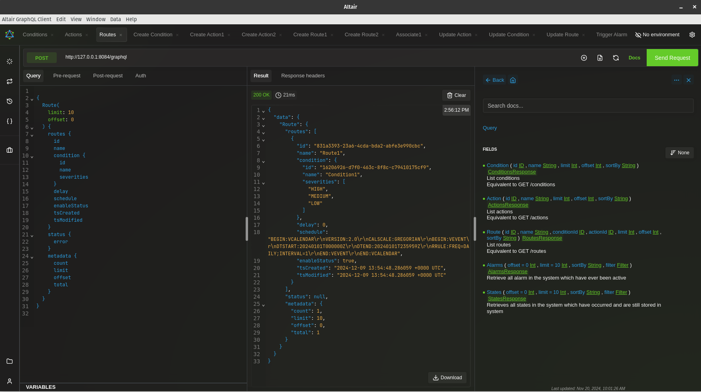

### Create an Action

- To create an Email Action, we use **[MailTrap](https://mailtrap.io/)**, a test email server that provides us with email credentials.
  Please sign up and **copy the credentials to use below**:

  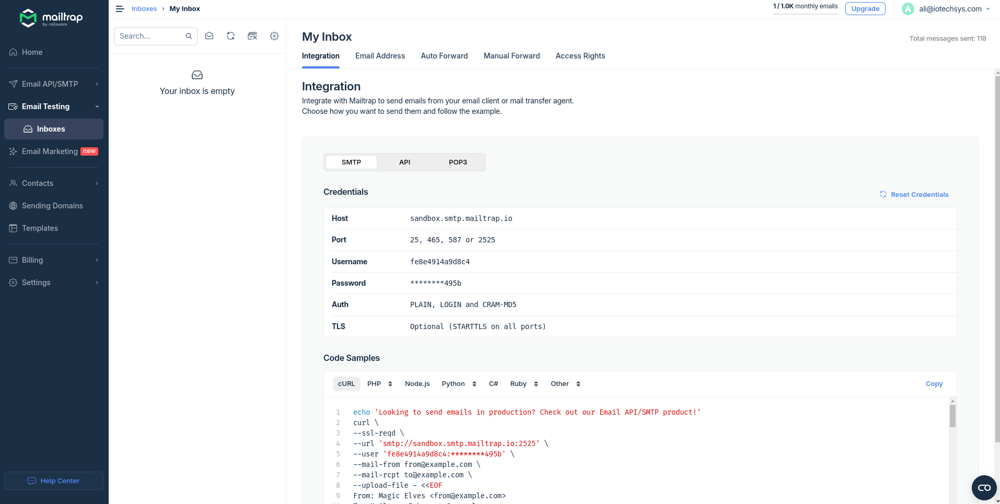

- Create an Email Action using the following JSON configuration and the following GraphQL mutation:

```JSON
{
"Config" : {
 "Hostname": "sandbox.smtp.mailtrap.io",
 "Port": "2525",
 "Username": "username",
 "Password": "password",
 "From": "from@example.com"
},
"Receivers": ["to@example.com"],
"Subject": "Test Email Action 1"
}
```

```GraphQL
mutation {
  ActionCreate(input: { name: "EmailAction1", type: EMAIL, enableStatus: true,
    config: "{\r\n\"Config\" : {\r\n \"Hostname\": \"sandbox.smtp.mailtrap.io\",\r\n \"Port\": \"2525\",\r\n \"Username\": \"fe8e4914a9d8c4\",\r\n \"Password\": \"4d2ae63574495b\",\r\n \"From\": \"from@example.com\"\r\n},\r\n\"Receivers\": [\"to@example.com\"],\r\n\"Subject\": \"Test Email Action 1\"\r\n}" }) {
    action {
      id
      name
      description
      type
      config
      enableStatus
      stopConditionType
      duration
      tsCreated
      tsModified
    }
    status {
      error
    }
  }
}
```

  Please notice that the JSON config string contents have been escaped (required by Altair), using an online free tool such as [link](https://www.freeformatter.com/json-escape.html), to remove Newline and Carriage return characters in the API call.

  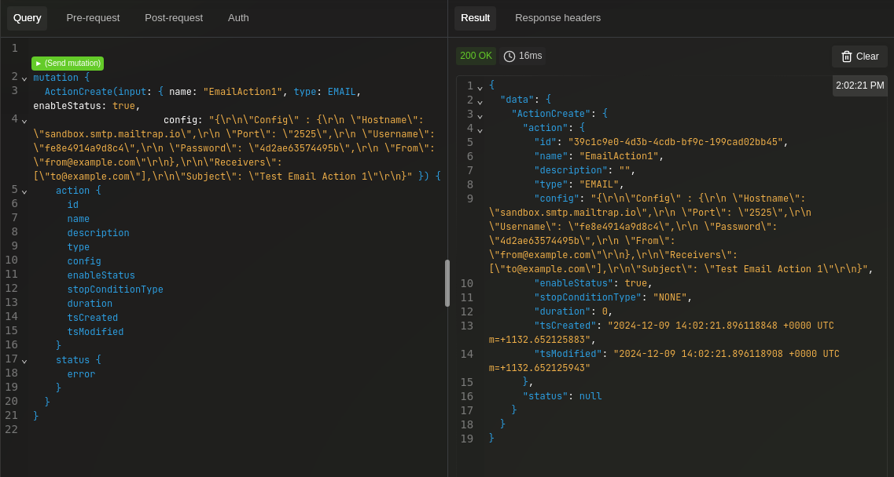
  
- To ensure the successful creation of the Action use the following GraphQL query:
```GraphQL
query{
  Action(
    limit: 10,
    offset: 0
  ) {
    actions {
      id
      name
      description
      type
      config
      enableStatus
      stopConditionType
      duration
      tsCreated
      tsModified
    }
    status {
      error
    }
    metadata {
      count
      limit
      offset
      total
    }
  }
}
```
  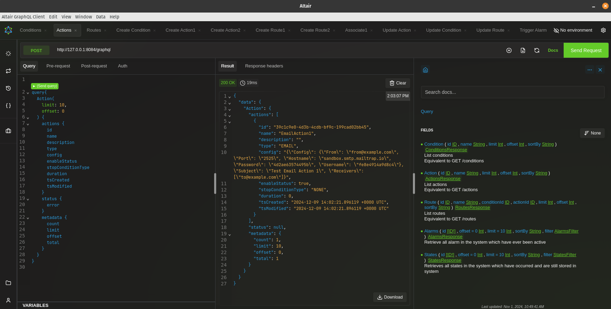

- Optionally, to create a Telegram Action one could use either use the Telegram app or desktop:
  - Search for **@Botfather** in Telegram. Write /help to see the options
  - Create a new bot with `/newbot`, and choose a unique name for it, for example: `TestABC123_Bot`
  - **@Botfather** will generate api token, copy it to somewhere safe
  - Create a new Telegram Group (e.g., `alarm-service`) and add the newly created bot as a member
  - Now write some text to the group to initialize it
  - Call `https://api.telegram.org/bot[token]/getUpdates` in your browser and look for the chat id
  - Copy the chat id to somewhere safe, please notice that the minus "-" sign must be included
  - In Altair create a new action with type Telegram and (JSON escaped - required by Altair) config using the generated token and chat_id:

```JSON
{
  "token": "7386979286:ABCDEFGHYGKLMNOPQRSTUVWXYZ",
  "chat_id": "-4512207336"
}
```

```GraphQL
mutation {
  ActionCreate(input: { name: "TelegramAction1", type: TELEGRAM, enableStatus: true, 
      config: "{\"token\":\"7386979286:AAHO2m1zWkSYlkDtTLdQKogvEhFomabDG3M\", \"chat_id\":\"-4512207336\"}" }) {
    action {
      id
      name
      description
      type
      config
      enableStatus
      stopConditionType
      duration
      tsCreated
      tsModified
    }
    status {
      error
    }
  }
}
```

### Associate the Route and Action

- Associate the Route with the created Action using the following GraphQL mutation:
  Please ensure you **copied the action ID** and **route ID** from the previous queries.

```GraphQL
mutation {
  RouteActionAssociate(actionId: "86e665ab-c66a-4c5f-8459-41f78863fad2",
    routeId: "e32d27e4-7072-45f4-83fd-3f24938b202f") {
    route {
      id
      name
      description
      condition{
        id
        name
      }
      delay
      retries
      schedule
      actions{
        id
        name
      }
      tsCreated
      tsModified
    }
    status {
      error
    }
  }
}
```

  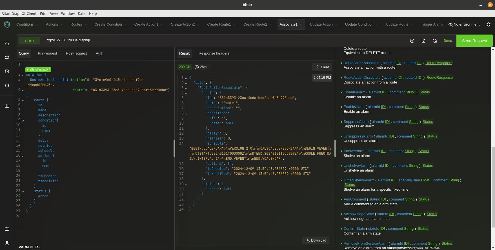

- To ensure the action has been successfully associated with the Route use the following GraphQL query:
```GraphQL
query {
  Route(
    limit: 10
    offset: 0
  ) {
    routes {
      id
      name
      condition {
        id
        name
        severities
      }
      actions{
        id
        name
        type
      }
      delay
      schedule
      enableStatus
      tsCreated
      tsModified
    }
    status {
      error
    }
    metadata {
      count
      limit
      offset
      total
    }
  }
}
```

Please notice the actions field in the output window should match the associated action details created previously.

  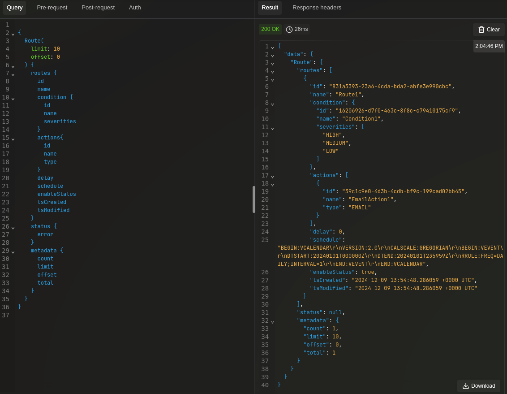

### Trigger a Test Alarm

- Trigger a test alarm with Medium level severity using the following GraphQL mutation:

```GraphQL
mutation {
  TriggerTestAlarm(severity: MEDIUM) {
    error
  }
}
```

  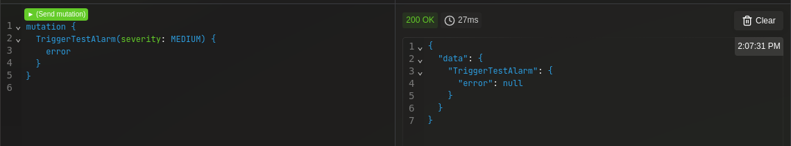

### View Alarm and Alarm States

- To confirm the Alarm has been triggered, view the Alarms using the following GraphQL query:

```GraphQL
query {
  Alarms(offset: 0, limit: 10, filter: {}) {
    alarms {
      id
      processValue
      applicationType
      description
      group
    }
    status {
      error
    }
    metadata {
      count
      limit
      offset
      total
    }
  }
}
```

  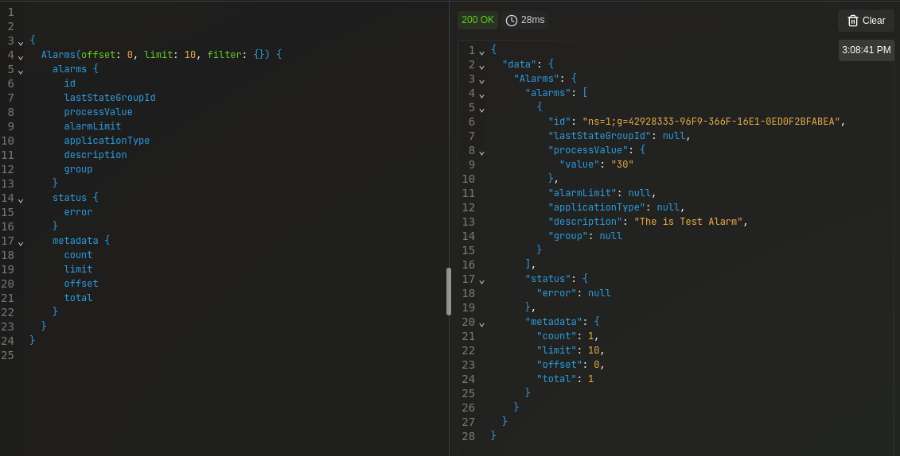

- Also, we can view Alarm States using the following GraphQL query:

```GraphQL
query{
  States(offset: 0, limit: 10, filter: {}) {
    alarmStates {
      id
      alarmId
      severity
      comment
      retain
      enabled
      acked
      confirmed
      active
      suppressed
      shelved
      outOfService
      latched
      timestamp
      routed
      userId
      status
    }
    status {
      error
    }
    metadata {
      count
      limit
      offset
      total
    }
  }
}
```  

  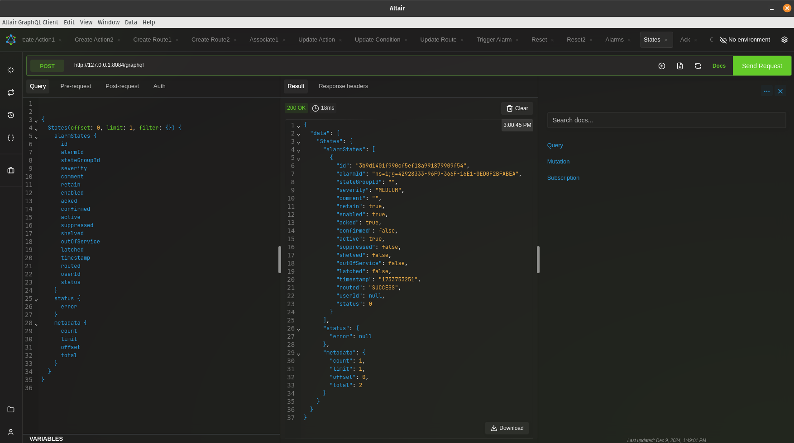
  please notice the routed field in the output window should be marked success and active field is true.

- We should now have received a test email indicating the alarm has been triggered:
  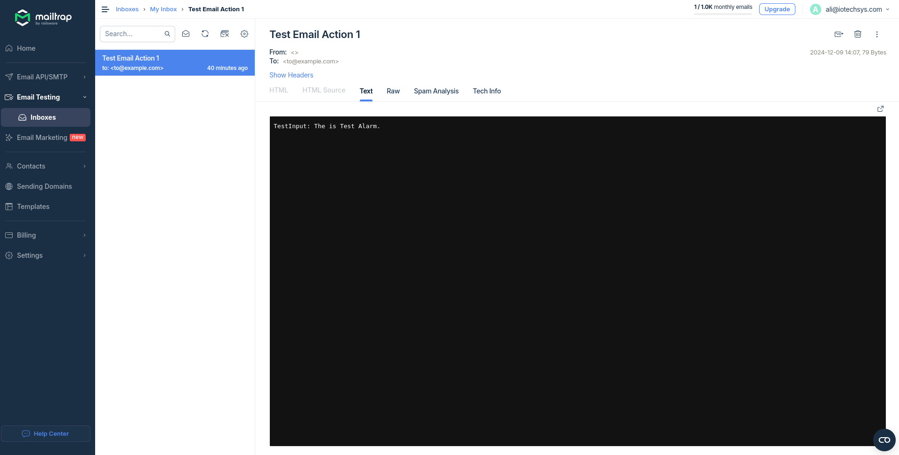

### Reset the Test Alarm

- Optionally, you can reset the test alarm using the following GraphQL mutation:

```GraphQL
mutation {
  ResetTestAlarm {
    error
  }
}
```
  

- To confirm the test alarm has been reset, we should see a new Alarm State with severity set to Low and the active field set to false:
  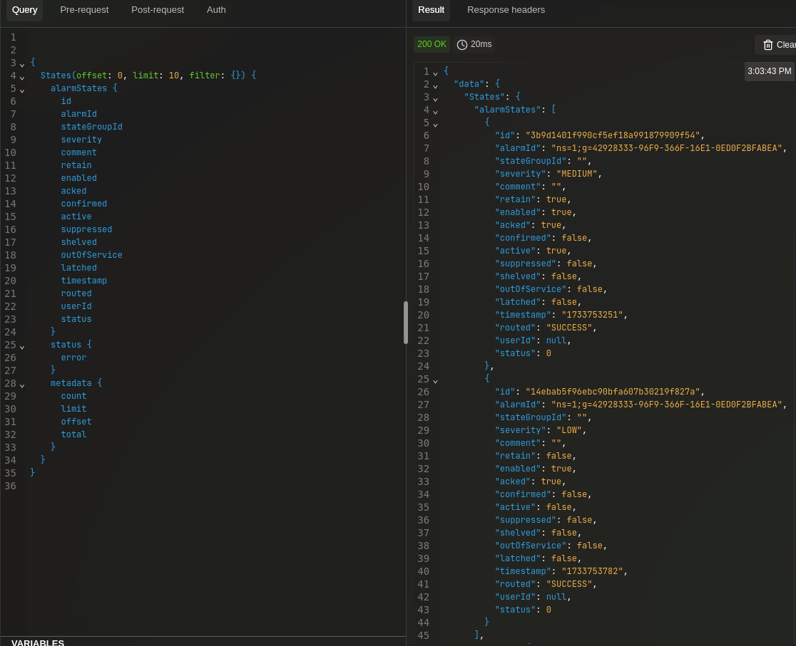

